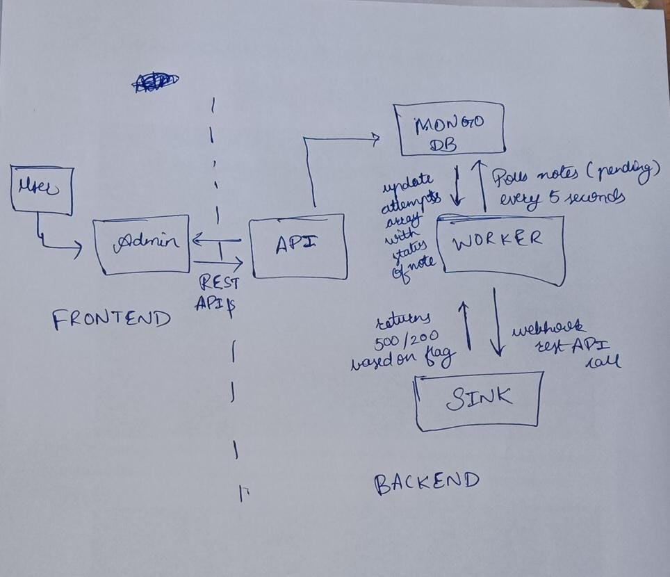

# 📝 Notes System

This project consists of multiple services (`admin`, `sink`, `api`, `worker`) running together with **MongoDB**, **Redis**, and Docker.

---

## 🚀 Docker Setup

### 1. Setup environment variables
```bash
cp .env.example .env
```

### 2. Run with Docker Compose
```bash
docker compose up --build
```

## 🚀 Local Setup

### 1. Install & start dependencies


First, install Redis and start the Redis server.

Next, install MongoDB and start the MongoDB server.

### 2. Setup environment files

In each app (admin, sink, api, worker), copy .env.example to .env:

```bash
cp .env.example .env
```

### 3. Install dependencies & run

In each app:
```bash
npm install
npm run dev
```

---

# Debug Diary Entry [Date 18/08/2025 - 27/08/2025]

---

## Issues Faced & Resolutions

### 1. Dockerfile for Admin Using Jest & Build Tools

**Issue:**  
The admin service Dockerfile build failed due to missing system build tools required by some dependencies.

**Fix:**  
Added system packages installation and adjusted npm install for legacy peer dependencies:

```dockerfile
# Install build tools (needed for some deps)
RUN apt-get update && apt-get install -y \
    python3 \
    make \
    g++ \
    && rm -rf /var/lib/apt/lists/*

# Copy package files
COPY package*.json ./

# Clean existing node_modules and lockfile, then install dependencies with legacy peer deps flag
RUN rm -rf node_modules package-lock.json && npm install --legacy-peer-deps

```

---

### 2. Worker Could Not Connect to Sink Service in Docker Compose

**Issue:**  
Worker job tasks remained in dead status because the worker could not reach the sink service.

**Root Cause:**  
The worker was sending requests to `http://localhost:4000/sink/webhook` which refers to its own container inside Docker, not the sink container.

**Fix:**  
Updated the URL in worker to use Docker Compose service name for DNS resolution:

-http://localhost:4000/sink/webhook
+http://sink:4000/sink/webhook

---


### 3. Pagination Issue in API Response

**Issue:**  
Pagination was not working as expected due to incorrect path for total pages in API response.

**Incorrect Access:**  
`resp.data.totalPages`

**Correct Access:**  
`resp.data.pagination.totalPages`

---

## Lessons Learned

- Always ensure Docker images have necessary native build tools for some dependencies.  
- Validate API response structure when implementing pagination or data access.  
- Use Docker Compose service names for inter-container communication instead of `localhost`.

---

## System Diagram



---

## Screen Cast

[Watch the demo here](https://youtu.be/efLmC4zcOuo)
